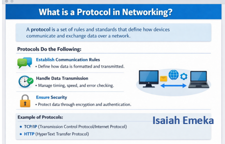
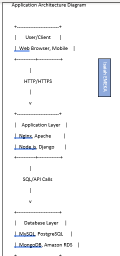
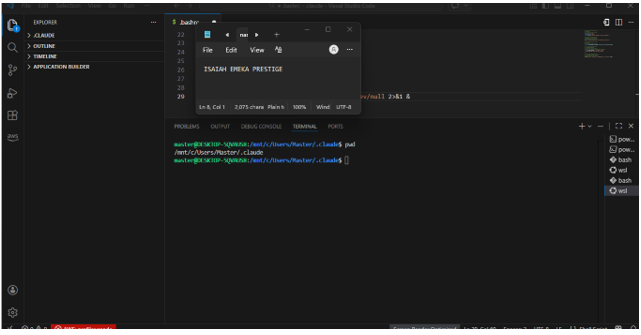

# Week 00 - Internet and Networking

Part of the DevOps Micro Internship (DMI) Cohort 3 with Agentic AI

---

# 🧑‍💻 Task 1: Using ChatGPT as Your Learning Assistant

## Scenario

You're new to DevOps and will frequently encounter technical questions. ChatGPT can be your learning companion.

## Your Task

Write a clear ChatGPT prompt to help you understand:

> "What is a protocol in networking? Explain with a simple real-life example."
A network protocol is a set of rules that allows devices to communicate with each other over a network.

Simple real-life example:
Think of two people having a phone conversation. They greet each other, take turns speaking, and say goodbye at the end. These rules help them communicate clearly.
Network protocols work the same way—they tell computers how to send, receive, and understand data.
Take a screenshot of your interaction showing:
Example: When you open a website, protocols like HTTP/HTTPS help your computer communicate with the web server and display the page correctly.

* Your detailed prompt (with clear expectations)
* ChatGPT's simplified response with an example

## Screenshot

Save your screenshot in the `screenshots` folder and update the file name below.




Replace `task-1-chatgpt.png` with your actual screenshot file name.

---

## What I Learned (2–3 lines)

A protocol in networking is basically a set of rules and conventions that devices follow to communicate with each other. It defines how data is formatted, transmitted, and received, so that both sides understand each other. Without protocols, computers and devices wouldn’t know how to send or interpret messages correctly.


---

# 🌐 Task 2: Internet and Networking

## Scenario

Your friend is launching an online bookstore named **EpicReads**.

He asked you to explain how users globally can access his website hosted in Finland.

## Your Task

Write a short explanation (**100–150 words**) that includes:

* Packet Switching
* IP Address
* TCP/IP
* HTTP/HTTPS

💡 **Tip:** You may use ChatGPT (as demonstrated in Task 1) to refine your explanation.

## Answer

this is how it works,When a user opens the EpicReads website, the internet breaks the request into small pieces called packets. This process is known as packet switching. The packets travel across the internet and are joined together again when they reach the server in Finland.

Every device connected to the internet has an IP address. The IP address helps the packets find the correct server. The TCP/IP protocol makes sure all the packets are delivered correctly, in the right order, and without losing any information.

After the connection is successful, HTTP or the more secure HTTPS protocol is used to send the website pages from the server to the user's web browser. This is how people from anywhere in the world can safely access and use the EpicReads online bookstore.


---

# 🏗️ Task 3: Application Architecture & Stack

## Scenario

EpicReads bookstore has two application versions:

### Two-Tier Application

* Frontend
* Database

### Three-Tier Application

* Frontend
* Backend
* Database

## Your Task

* Draw simple diagrams (hand-drawn or tool-based such as draw.io)
* Label each layer clearly
* List at least two common technologies or tools used for each layer
* Submit a screenshot or photo clearly showing your own drawing

## Diagram Screenshot / Photo

Save your diagram image in the `screenshots` folder and update the file name below.




Replace `task-3-diagram.png` with your actual diagram file name.

---

## Technologies Used

### Frontend

* HTML
* CSS

### Backend

* Node.js
*Python(Django/Flask)

### Database

* MySQL
* MongoDB

---

# 🌍 Task 4: Domain Name & DNS (Basic Concepts)

## Scenario

Your friend's bookstore **EpicReads** is currently accessible through:

```text
52.172.142.222:3000
```

He purchased the domain:

```text
epicreads.com
```

## Your Task

In **50–100 words**, explain in your own words:

1. What is DNS (Domain Name System)?
2. Which DNS record type should be used to connect the domain to the given IP, and why?

## Answer
DNS (Domain Name System) is like the internet's phonebook. It changes a website name, such as epicreads.com, into an IP address that computers use to find the correct server. To connect a domain to an IP address, you use an A Record. An A Record links the domain name directly to the server's IPv4 address, making it possible for users to access the website by typing the domain name instead of remembering a long string of numbers.

---

# 💻 Task 5: Visual Studio Code Setup (Hands-on)

## Your Task

Install Visual Studio Code (if not already installed).

Take a screenshot of your VS Code environment showing:

* Terminal open inside VS Code
* Running a basic command:

### Windows

```powershell
dir
```

### Linux / macOS

```bash
pwd
ls
```

* Your selected VS Code theme clearly visible

⚠️ **Important:** The screenshot must show your username or another identifiable detail to confirm it is your environment.

## Screenshot

Save your screenshot in the `screenshots` folder and update the file name below.




Replace `task-5-vscode.png` with your actual screenshot file name.

---

# 🔗 Task 6: Publish Your Assignment as a LinkedIn Post

## Objective

Publishing on LinkedIn helps you:

* Build your professional online presence
* Reinforce your learning
* Document your DevOps journey publicly

## Your Task

Summarize your answers from Tasks 1–5 into a LinkedIn post.

Clearly structure your post into the following sections:

* ChatGPT
* Internet & Networking
* App Architecture
* DNS
* VS Code Setup

Add the following credit note at the end of your post:

> **P.S. This post is a part of DevOps Micro Internship with Agentic AI Cohort-3 by Pravin Mishra. You can start your DevOps journey by joining this Discord community: https://discord.pravinmishra.com/**

---

## LinkedIn Post URL

Paste your LinkedIn post URL here:

```text
https://www.linkedin.com/posts/isaiah-emeka_excited-to-continue-my-devops-learning-journey-activity-7441918697587240960-W9tw?utm_source=share&utm_medium=member_desktop&rcm=ACoAACVu5ZIB9xxe8ggssg_Vju5TD-v77SHgNAg
```

---

## LinkedIn Post Backup Copy

Paste the full text of your LinkedIn post here:

Excited to Continue My DevOps Learning Journey with DMI Cohort 3
I’m thrilled to announce that I’ve officially started my DevOps Micro Internship (DMI) – Cohort 3! This marks the beginning of an exciting journey into the world of DevOps, where I’ll be deepening my skills across cloud infrastructure, networking, automation, and application deployment.

Below are my week 0 Key Learnings:
 What ChatGPT is: ChatGPT is an AI-powered language model developed by OpenAI that can understand and generate human-like text.
It does the following>>>
- Explain concepts in simple terms
- Help with writing – emails, reports, code, or social media posts
- Solve problems like coding, math, or logic puzzles
- Brainstorm ideas – for projects, content, or learning paths
It works by analyzing huge amounts of text from the internet to predict the most likely response to your input. It’s not sentient, but it’s great at providing guidance, explanations, and examples.

Internet & Networking:
All about Understanding how devices communicate, protocols like HTTP/TCP, IP addressing, and secure data transfer are crucial for cloud and DevOps workflows.

App Architecture: Application Architecture (App Architecture) is the structured design of how a software application is built and how its components interact. It defines the layers, components, and technologies that work together to deliver a functional application. Think of it as the blueprint for your app—how the user interface, business logic, data storage, and infrastructure all fit and communicate.

I learnt how applications are structured:
Frontend: User interfaces
Backend: Business logic & APIs
Database: Data storage & management

Cloud Infrastructure: Cloud Infrastructure refers to the combination of hardware, software, network resources, and services that are needed to support the delivery of computing resources (like servers, storage, databases, networking, and software) over the internet. Instead of hosting resources on your own physical servers, cloud infrastructure allows you to access and manage these resources remotely via cloud providers such as AWS, Azure, or Google Cloud.
Hosting, virtual servers, storage, and networking

DNS (Domain Name System):
DNS translates domain names into IPs, enabling global accessibility. I explored record types such as A, CNAME, and MX, which are essential for deploying apps.

VS Code Setup:
Visual Studio Code (VS Code) is a free, open-source, and lightweight code editor developed by Microsoft. A VS Code setup is basically the process of preparing Visual Studio Code (VS Code) so it’s ready for coding and development. It’s not just installing the software—it’s configuring it to work efficiently for your projects.

P.S. This post is part of the FREE DevOps Micro Internship Cohort run by Pravin Mishra. You can start your DevOps journey for free from his YouTube Playlist.

---

# Reflection – Week 0

### What did you find easy?

1. Using ChatGPT to understand complex concepts in simple terms.
2. Setting up VS Code with extensions and Git integration.
3. Visualizing application layers (frontend, backend, database, cloud) and seeing how they interact.


---

### What was difficult?

1. Fully grasping networking protocols (TCP/IP, HTTP/HTTPS) and how data flows across the internet.
2. Understanding DNS record types and when to use A, CNAME, or MX records.
3. Connecting all layers together in a real cloud deployment scenario—it takes practice to see the big picture.


---

### What will you improve next week?

1. Hands-on Networking: Practice configuring networks, IPs, and security groups to strengthen my understanding of internet protocols.
2. DNS Management: Experiment with different DNS records and domain setups to confidently deploy applications globally.
3. App Deployment: Try end-to-end deployment of a small application on cloud infrastructure to connect frontend, backend, database, and hosting layers.
4. VS Code Workflow: Explore advanced debugging, extensions, and automation to further optimize my coding and DevOps workflow.


---

## 📌 About DMI & CloudAdvisory

DevOps Micro Internship (DMI) is a project-based DevOps program run by Pravin Mishra (The CloudAdvisory) focused on real-world execution, systems thinking, and career readiness.

It helps learners build strong DevOps foundations with hands-on experience.


## 📌 Resources

- 🌐 **DMI Official Website:** https://pravinmishra.com/dmi  
- 🎓 **DevOps for Beginners (Udemy):** https://www.udemy.com/course/devops-for-beginners-docker-k8s-cloud-cicd-4-projects/  
- 🎓 **Ultimate Agentic AI DevOps with Clude Code** https://www.udemy.com/course/ultimate-agentic-ai-devops-with-claude-code/?referralCode=448389767BC96284087B
- 🎓 **DevOps with Claude Code: Terraform, EKS, ArgoCD & Helm** https://www.udemy.com/course/devops-with-claude-code-terraform-eks-argocd-helm/?referralCode=1C5B734505D65A010FA3
- ▶️ **YouTube Playlist (DMI Cohort 3):** https://www.youtube.com/playlist?list=PLFeSNDtI4Cho  
- 🔗 **Pravin Mishra (LinkedIn):** https://www.linkedin.com/in/pravin-mishra-aws-trainer/  
- 🏢 **CloudAdvisory (LinkedIn):** https://www.linkedin.com/company/thecloudadvisory/

---

*This submission is part of DevOps Micro Internship (DMI) Cohort 3 — Agentic AI Track*