# Assignment 3 — Production Maintenance Drill (OPS Checklist)

Part of the DevOps Micro Internship (DMI) Cohort 3 with Agentic AI

---

## Purpose

In this assignment, you will treat your already deployed React application (on Ubuntu VM with Nginx) as a live production system. You will perform structured operational checks covering network validation, service health, log analysis, resource monitoring, configuration verification, and incident simulation with recovery — mirroring real on-call DevOps responsibilities.

---

# Task 1 — Server Access & Networking Validation

## Goal

Verify that the deployed React application is reachable from the browser and confirm basic network connectivity of the Ubuntu VM.

### Evidence

#### Screenshot 1 — Browser showing the React app with your Full Name visible on the UI

---

#### Screenshot 2 — Output of `ip a`

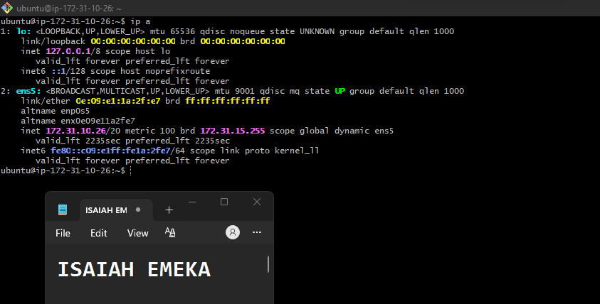

---

#### Screenshot 3 — Output of `sudo ss -tulpen`

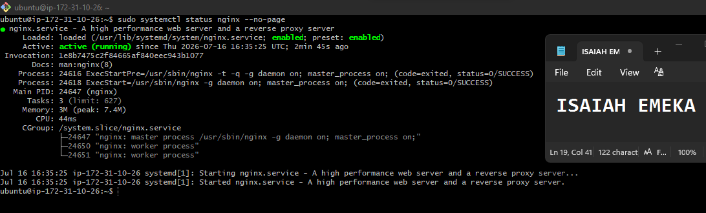

---

#### Screenshot 4 — Output of `sudo ufw status`

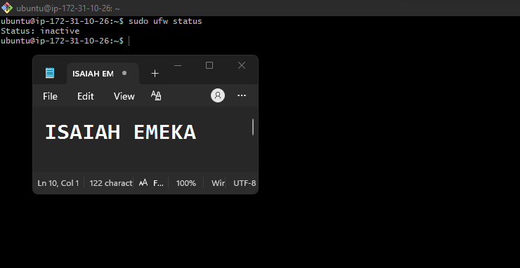

---

### Notes

Answer the following in your own words:

**1. What proves Nginx is listening on 0.0.0.0:80?**

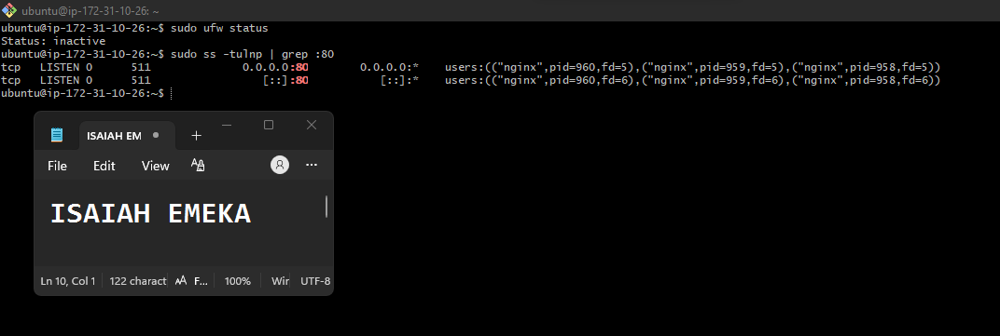

---

**2. What proves SSH is active on port 22?**

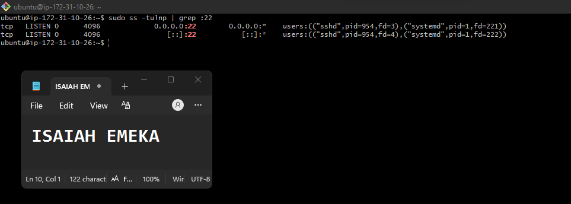

---

**3. Did you find any unexpected open ports? Explain briefly.**

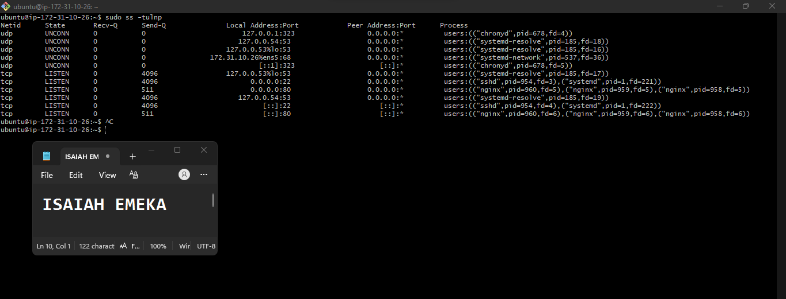
there are no unexpected open ports. Everything shown is normal for a basic Ubuntu web server running Nginx.

---

# Task 2 — Service Health & Systemd Validation (Nginx)

## Goal

Verify that Nginx is properly installed, running, enabled at boot, and safely configured.

### Evidence

#### Screenshot 1 — Output of `systemctl status nginx --no-pager`

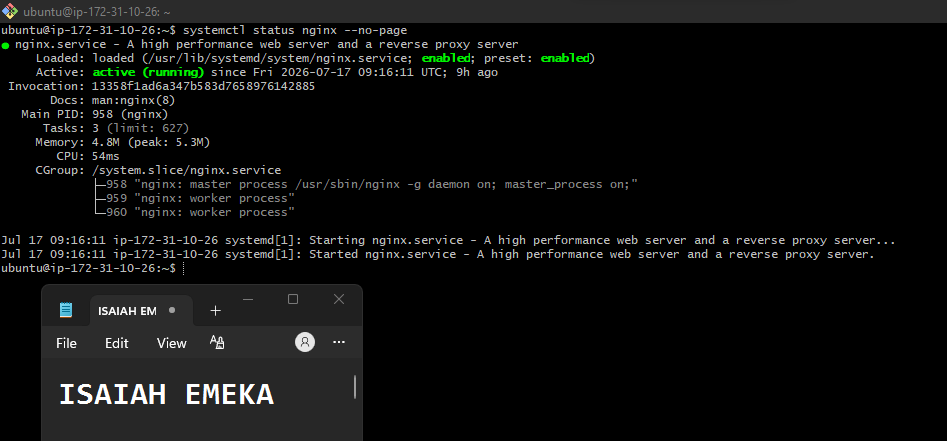

---

#### Screenshot 2 — Output of `sudo nginx -t`

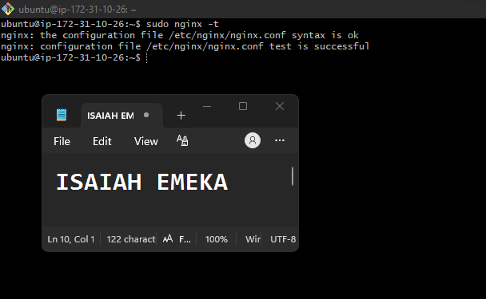

---

#### Screenshot 3 — Output of `sudo ss -lptn '( sport = :80 )'`

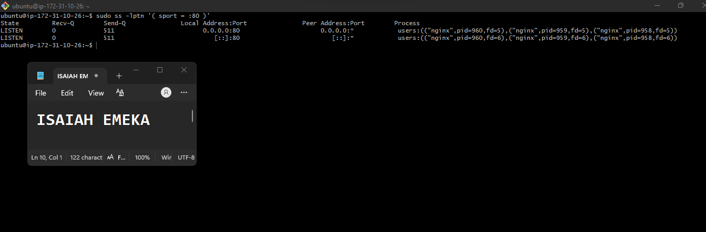
---

### Notes

Answer the following in your own words:

**1. What happens if Nginx fails to restart in production?**

Write your answer here.
If Nginx fails to restart in production, the web server may stop serving requests, making websites or applications unavailable to users. This can result in downtime, failed health checks, and potential business impact until the issue is identified and resolved.
---

**2. What's your basic rollback plan?**

A basic rollback plan is:

1.i will not restart repeatedly—check the cause of the failure first.
2.Test the configuration with:sudo nginx -t
3.Restore the last known working configuration or backup if the current configuration is faulty.
4.Restart Nginx:sudo systemctl restart nginx
5.Verify the service is running:sudo systemctl status nginx
curl http://localhost
6.

---

# Task 3 — Logs & Request Trace

## Goal

Verify real traffic flow and analyze logs to understand system behavior and errors.

### Evidence

#### Screenshot 1 — Output of `sudo tail -n 30 /var/log/nginx/access.log`

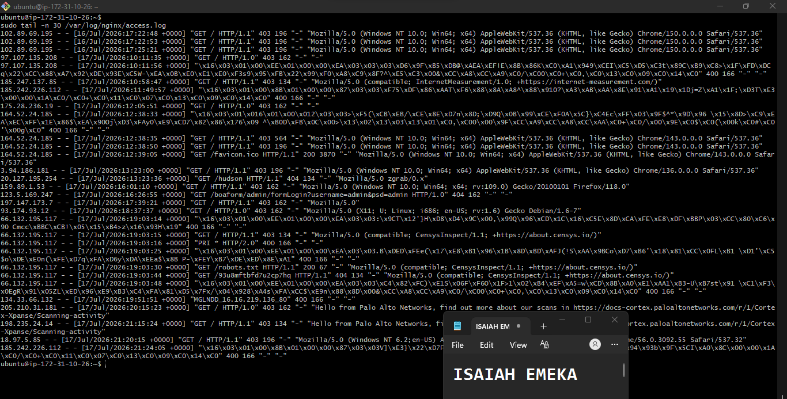

---

#### Screenshot 2 — Output of `sudo tail -n 30 /var/log/nginx/error.log`

---

#### Screenshot 3 — Output of `sudo journalctl -u nginx --no-pager -n 50`

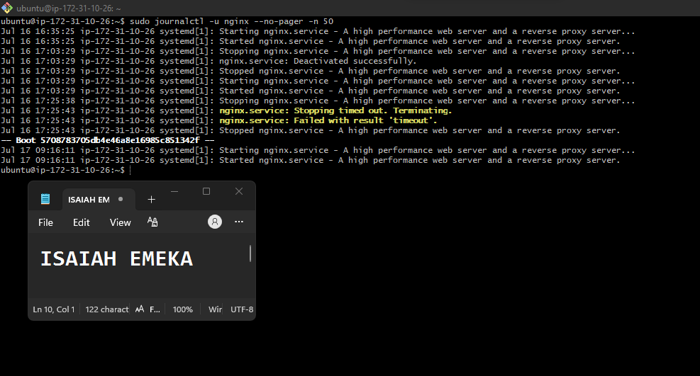

---

### Notes

Answer the following in your own words:

**1. Were there any errors in the logs?**

- If yes, mention 1–2 example error lines from the logs and explain what each one means in simple terms.
- If no, explain what it means if the error log is empty or shows no recent errors during your check.

Write your answer here.
yes because of the following reasons:
1. Another client (IP 97.107.135.208) attempted to access your web server.
The request reached Nginx successfully, but there was no default web page to serve.
2. Since directory browsing is disabled, Nginx denied access and returned a 403 Forbidden response.
---

**2. If there were no errors, what does that indicate about the system?**

1. Nginx is operating normally and has not encountered any recent problems while handling requests.
2. The web server is successfully serving requests without configuration or runtime errors.
3. There are no recent issues such as missing files, permission problems, or application failures recorded in the error log.

---

**3. Based on the access logs, were your curl requests visible in the log entries? What does that prove about traffic flow?**

No. Based on the portion of the access log i got, I do not see any curl requests.

A typical curl request would appear with a User-Agent similar to:

what this prove is that If you executed a command like:curl http://172.31.10.26
and no corresponding entry appears in access.log, it generally means the request never reached Nginx.

# Task 4 — System Resource Health Check (Capacity Red Flags)

## Goal

Assess server capacity and detect potential performance or failure risks.

### Evidence

#### Screenshot 1 — Output of `uptime`

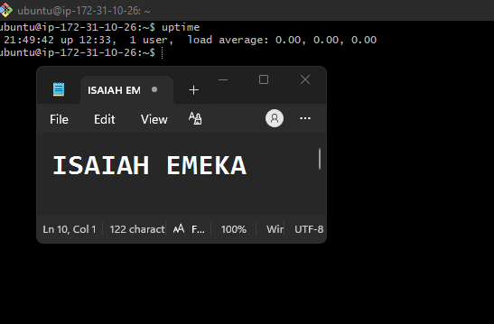

---

#### Screenshot 2 — Output of `free -h`

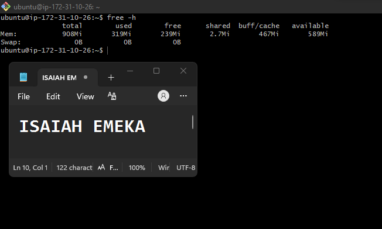

---

#### Screenshot 3 — Output of `df -h`

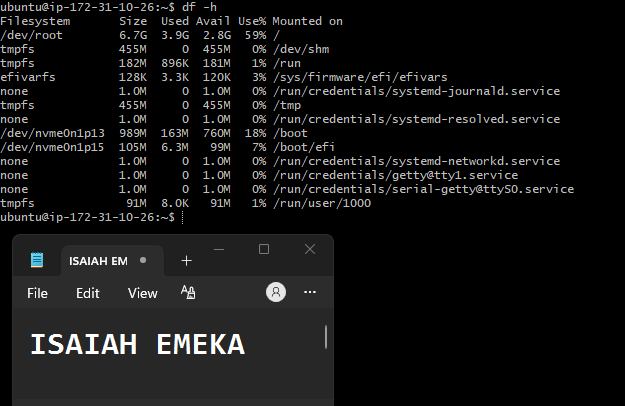

---

#### Screenshot 4 — Output of `sudo du -sh /var/* | sort -h`

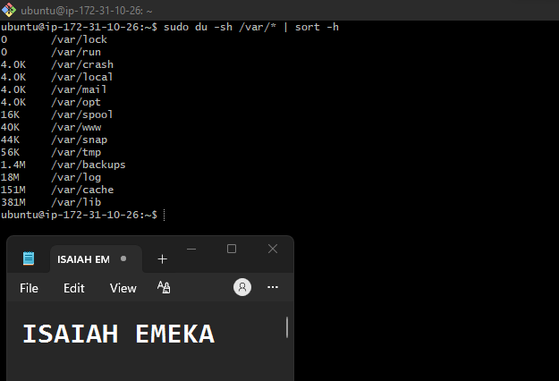

---

### Notes

Answer the following in your own words:

**1. Which resource looks most critical right now? (CPU/load, memory, or disk) Explain why.**

Most critical resource: Memory

Memory is the most critical resource because:

The server has less than 1 GB of RAM, which is quite limited for running services like Nginx, application processes, and other background tasks.
There is no swap space configured. Without swap, if memory usage suddenly spikes, the Linux Out-of-Memory (OOM) killer may terminate processes to free RAM, potentially causing application downtime.
Although the disk is only 59% full, leaving sufficient free space, and there were no signs of high CPU utilization, the combination of limited RAM and no swap poses the greatest operational risk

---

**2. What happens if disk becomes 100% full in a production server?**

If a production server's disk reaches 100% capacity, it can cause serious service disruptions and even complete outages.

---

# Task 5 — Configuration & Deployment Verification

## Goal

Ensure the correct React build is deployed and Nginx is serving it properly.

### Evidence

#### Screenshot 1 — Output of `ls -lah /var/www/html | head -n 20`

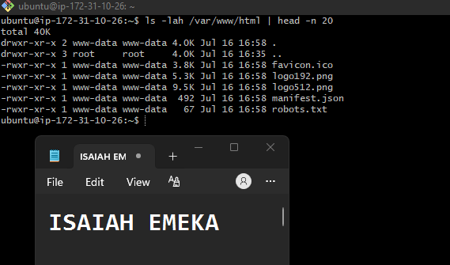

---

#### Screenshot 2 — Output of `grep -R "Deployed by" -n /var/www/html 2>/dev/null | head`
![ Output of `grep -R "Deployed by" -n /var/www/html 2>/dev/null | head]
(week-03-Assignment-03-screenshot20.png)

---

#### Screenshot 3 — Output of `grep -n "try_files" /etc/nginx/sites-available/default`

51:        try_files $uri $uri/ /index.html;
---

### Notes

Answer the following in your own words:

**1. How do you confirm that the correct version of the application is deployed?**

Write your answer here.
I verify the deployed version by checking the application's version endpoint, comparing the running Git commit hash with the approved release commit, reviewing deployment logs, confirming the correct Docker image or Kubernetes deployment version, and running smoke tests against critical application functionality. This ensures both the correct build and expected behavior are running in production.
---

# Task 6 — Nginx Configuration Failure Simulation

## Goal

Simulate a real-world Nginx misconfiguration and recover the service safely.

### Evidence

#### Screenshot 1 — Output of `sudo nginx -t` showing the syntax error (broken config)

Add your screenshot here.

---

#### Screenshot 2 — Output of `sudo nginx -t` showing syntax ok (fixed config)

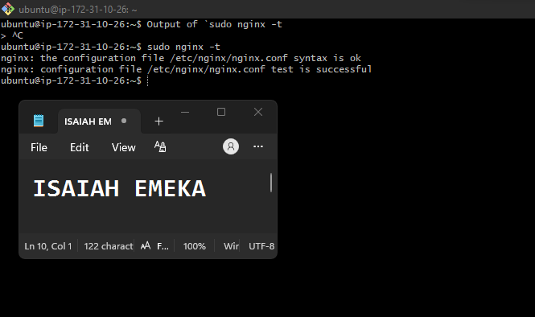

---

#### Screenshot 3 — Output of `curl -I http://<public-ip>` confirming recovery (200 OK)

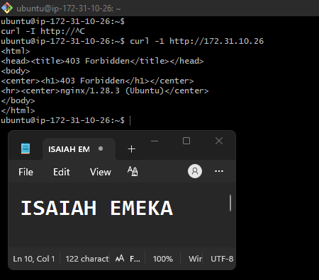

---

### Notes

Answer the following in your own words:

**1. What caused the configuration failure?**

the configuration failure was caused by Nginx not having a valid default page or index file to serve from the web root.

---

**2. How did you fix the issue?**

1. Verified the web root contains an index file=ls -l /var/www/html
2. Check the Nginx configuration:sudo nginx -T
3.Confirm file permissions:ls -ld /var/www/html,ls -l /var/www/html/index.html
4. Test the configuration:sudo Nginx -t
5. Reload Nginx after making changes:sudo systemctl reload nginx

---

**3. How can you avoid this kind of issue in real production systems?**

To avoid this type of issue in production, combine configuration validation, automated deployments, health checks, proper file permissions, continuous monitoring, staging environments, and rollback strategies. These practices help detect configuration errors early, reduce downtime, and ensure users consistently receive a working application.

---

# Task 7 — Web Application Failure Simulation

## Goal

Simulate missing deployment content and recover the application safely.

### Evidence

#### Screenshot 1 — Output of `curl -I http://<public-ip>` showing failure (non-200 response)

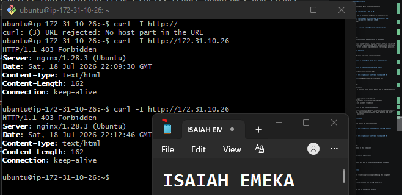

---

#### Screenshot 2 — Output of `curl -I http://<public-ip>` confirming recovery (200 OK)

Add your screenshot here.

---

### Notes

Answer the following in your own words:

**1. What caused the application to break in this scenario?**

Nginx was unable to serve the application's home page, resulting in an HTTP 403 Forbidden response.

---

**2. How did you fix the issue and restore the application?**

1. Checked the Nginx error logs to identify the cause.
2. Restored the missing application files or corrected the web root.
3. Verified file permissions.
4. Tested the Nginx configuration (nginx -t).
5. Reloaded Nginx.
6. Confirmed the application was accessible and serving successfully.

---

**3. What steps would you take to prevent this kind of issue in real production systems?**

I would always test the Nginx configuration before deploying changes, verify that the application files are in the correct location, and ensure the proper file permissions are set. I would perform a health check after deployment using curl or a browser to confirm the application is working, monitor logs for any errors, and test changes in a staging environment before deploying to production.

---

# Task 8 — Security & Reliability Review

## Goal

Review and reflect on the security and reliability practices applied during this assignment.

### Security & Reliability Notes

Answer the following in your own words:

**1. Why is SSH key-based authentication more secure than sharing passwords?**

SSH key-based authentication is more secure because it uses digital keys instead of passwords. The private key stays on your computer and is never shared, making it much harder for attackers to access the server than with a password.

---

**2. Why should only required ports be open on a production server?**

Only the required ports should be open because every open port is a possible entry point for attackers. Closing unused ports makes the server more secure and reduces security risks.

---

**3. Why is it important for Nginx to be enabled on boot?**

Only the required ports should be open to keep the server secure. Every open port is a possible way for attackers to access the server. By opening only the ports the application needs, you reduce security risks and protect the server from unauthorized access.

---

**4. What are the risks of sharing secrets, keys, or credentials publicly?**

Sharing secrets, keys, or credentials publicly is like giving someone the keys to your house. Anyone who gets them can access your server or cloud account, steal data, make unwanted changes, or even run up your cloud bill. That's why it's important to keep them private and never upload them to places like GitHub or share them with others.

---

**5. Why should cloud resources be stopped or terminated when they are no longer needed?**

Cloud resources should be stopped or deleted when you no longer need them so you don't keep paying for something you're not using. It's like turning off the lights when you leave a room—you save money and avoid wasting resources. It also helps keep your cloud account clean and more secure.

---

# LinkedIn Post (Required)

## Evidence

#### LinkedIn Post URL

Paste your LinkedIn post URL here:https://www.linkedin.com/posts/isaiah-emeka_deployment-is-only-the-beginning-my-journey-ugcPost-7484383948140371968-qIBn/?utm_source=share&utm_medium=member_desktop&rcm=ACoAACVu5ZIB9xxe8ggssg_Vju5TD-v77SHgNAg

www.linkedin.com/in/isaiah-emeka

---

#### Screenshot — Published LinkedIn post

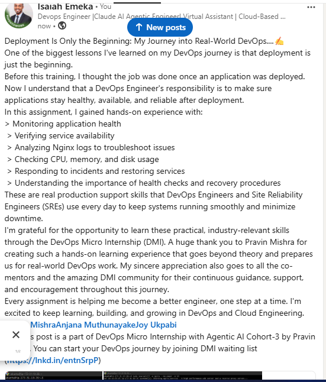

---

# Submission Instructions

- Add all required screenshots in your submission
- Full name must be visible in required screenshots
- Do not expose sensitive information (keys, passwords, account IDs)

---

# Completion Checklist

- [ ] Task 1: Screenshots (browser, ip a, ss -tulpen, ufw status) + Notes answered
- [ ] Task 2: Screenshots (nginx status, nginx -t, ss port 80) + Notes answered
- [ ] Task 3: Screenshots (access log, error log, journalctl) + Notes answered
- [ ] Task 4: Screenshots (uptime, free -h, df -h, du -sh) + Notes answered
- [ ] Task 5: Screenshots (ls html, grep deployed by, grep try_files) + Notes answered
- [ ] Task 6: Screenshots (nginx -t fail, nginx -t pass, curl recovery) + Notes answered
- [ ] Task 7: Screenshots (curl failure, curl recovery) + Notes answered
- [ ] Task 8: Security & Reliability Notes answered
- [ ] LinkedIn post published and URL submitted
- [ ] Full Name visible in all required screenshots
- [ ] No sensitive data exposed

---

## 📌 About DMI & CloudAdvisory

DevOps Micro Internship (DMI) is a project-based DevOps program run by Pravin Mishra (The CloudAdvisory) focused on real-world execution, systems thinking, and career readiness.

It helps learners build strong DevOps foundations with hands-on experience.

---

## 📌 Resources

- 🌐 DMI Official Website: https://dmi.pravinmishra.com?utm_source=github&utm_medium=readme  
- 🎓 University: https://university.pravinmishra.com?utm_source=github&utm_medium=readme  
- 💬 Discord Community: https://discord.pravinmishra.com?utm_source=github&utm_medium=readme  
- 📝 Blog: https://dmi.pravinmishra.com/blog?utm_source=github&utm_medium=readme  
- ▶️ YouTube Playlist: https://www.youtube.com/playlist?list=PLFeSNDtI4Cho  
- 🔗 Pravin Mishra (LinkedIn): https://www.linkedin.com/in/pravin-mishra-aws-trainer/  
- 🏢 CloudAdvisory (LinkedIn): https://www.linkedin.com/company/thecloudadvisory/

---

*This submission is part of DevOps Micro Internship (DMI) Cohort 3 — Agentic AI Track.*