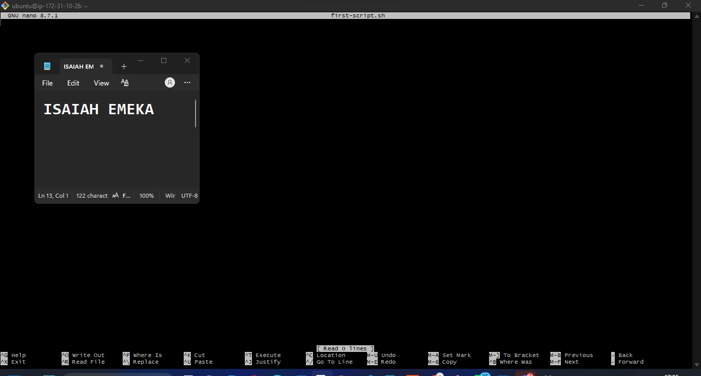
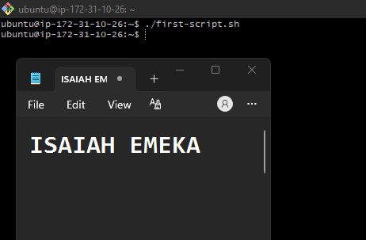
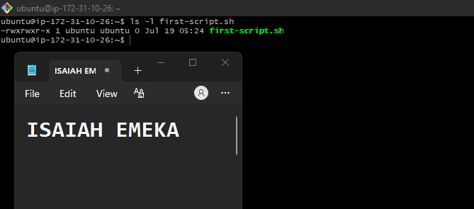
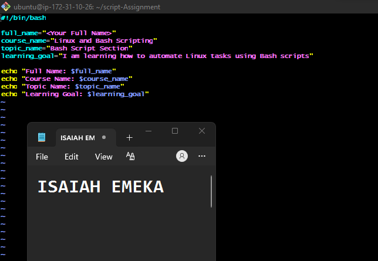
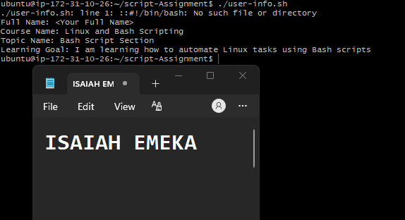
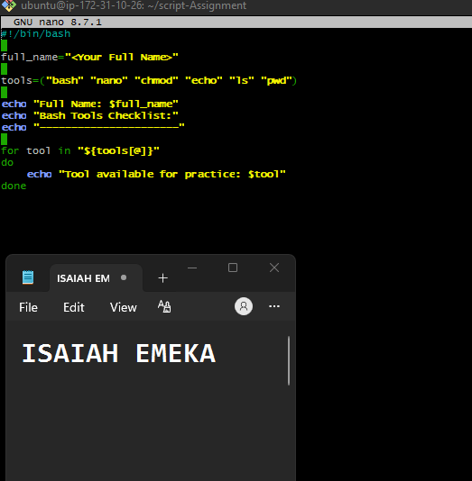
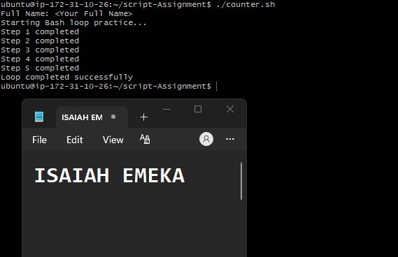
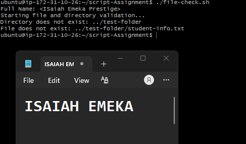
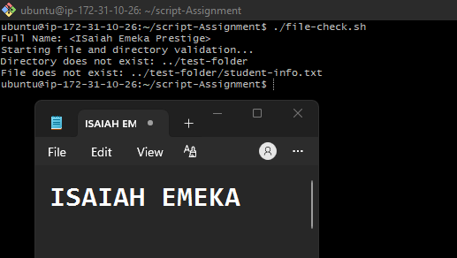

# Assignment 5 — Bash Script Automation Drill (OPS Checklist)

Part of the DevOps Micro Internship (DMI) Cohort 3 with Agentic AI

---

## Purpose

In this assignment, you will practice Bash scripting by building a series of small automation scripts covering environment setup, variables, arrays, loops, file conditionals, if-else logic, and functions. These scripts form the foundation of real-world Linux automation used in DevOps, cloud, and production support environments.

---

# Task 1 — Bash Environment & Workspace Setup

## Goal

Verify that Bash is available on your system and create a clean workspace for this assignment.

### Evidence

#### Screenshot 1 — Output of `echo $SHELL` and `bash --version`

---

#### Screenshot 2 — Output of `pwd` and `ls -lah` showing the scripts directory

---

### Notes

Answer the following in your own words:

**1. What is Bash?**

Bash is the most command and widely used shell in Linux.it stands for bourne again shell.it's the default for many destribution of many LInux company.Bash is a command-line shell that allows you to interact with and control a Linux or Unix operating system by typing commands.Bash as a translator between you and the operating system. You type a command, Bash understands it, tells the operating system what to do, and then shows you the result.
---

**2. What is the difference between shell and Bash?**

Shell	Bash
A shell is a general program that lets you communicate with the operating system using commands.while a bash is a type of shell
---

**3. Why is it important to confirm the Bash version before writing scripts?**

A script that works on one Bash version may not work on another if it uses features that aren't supported. Checking the Bash version helps ensure your script runs correctly and avoids unexpected errors.different version of bash supports different features and commands.

---

# Task 2 — Your First Bash Script

## Goal

Create your first Bash script, make it executable, and run it from the terminal.

### Evidence

#### Screenshot 1 — Content of `first-script.sh`

---

#### Screenshot 2 — Output of `./first-script.sh`

---

#### Screenshot 3 — Output of `ls -l first-script.sh` showing executable permission

---

### Notes

Answer the following in your own words:

**1. What is the purpose of `#!/bin/bash`?**

#!/bin/bash is called the shebang. It tells the operating system to run the script using the Bash shell.
---

**2. Why do we use `chmod +x` before running a script?**

We use chmod +x to make a script executable

---

**3. What is the difference between running a script using `./script.sh` and `bash script.sh`?**

./script.sh runs the script directly. The script must have execute permission (chmod +x) and should include the shebang (#!/bin/bash) to tell Linux which shell to use.
bash script.sh tells Bash to run the script directly. The script does not need execute permission, because you're asking Bash to read and execute the file.

---

# Task 3 — Variables: User Information Script

## Goal

Use variables to store and display user-related information.

### Evidence

#### Screenshot 1 — Content of `user-info.sh`

---

#### Screenshot 2 — Output of `./user-info.sh`

---

### Notes

Answer the following in your own words:

**1. What is a variable in Bash?**

A variable in Bash is a named container used to store a value that can be used later in a script. Instead of typing the same value repeatedly, you store it in a variable and refer to it by its name.

---

**2. Why should we avoid spaces around the `=` sign when creating variables?**

You should avoid spaces around the = sign because Bash will not recognize it as a variable assignment. Instead, it will treat the variable name and value as separate commands, which can cause an error.

---

**3. How do you access the value stored inside a Bash variable?**

You access the value stored in a Bash variable by placing a $ (dollar sign) before the variable name.

---

# Task 4 — Arrays & Loops: Tools Checklist Script

## Goal

Use arrays and loops to print a checklist of tools used in Bash scripting.

### Evidence

#### Screenshot 1 — Content of `tools-checklist.sh`

---

#### Screenshot 2 — Output of `./tools-checklist.sh`

---

### Notes

Answer the following in your own words:

**1. What is an array in Bash?**

An array in Bash is a variable that can store multiple values instead of just one. Each value is stored in a numbered position called an index.

---

**2. Why are arrays useful in scripts?**

Arrays are useful because they let you store and manage multiple values in one variable. This makes your scripts shorter, more organized, and easier to work with, especially when dealing with lists of items like files, names, or servers.

---

**3. What does `"${tools[@]}"` mean?**

"${tools[@]}" means "all the values stored in the tools array." It is used when you want to access every element in the array.

---

**4. What is the purpose of the `for` loop in this script?**

The for loop is used to repeat a set of commands for each item in a list or array. It saves you from writing the same code multiple times.

---

# Task 5 — Loops: Number Counter Script

## Goal

Use loops to repeat a task multiple times.

### Evidence

#### Screenshot 1 — Content of `counter.sh`

---

#### Screenshot 2 — Output of `./counter.sh`

---

### Notes

Answer the following in your own words:

**1. What is a loop?**

A loop is a programming structure that repeats a block of code multiple times until all items have been processed or a condition is met.

---

**2. Why do we use loops in Bash scripting?**

We use loops in Bash scripting to automate repetitive tasks. Instead of writing the same command multiple times, a loop runs it repeatedly for each item or until a condition is met.

---

**3. How many times did the loop run in your script?**

5 times

---

**4. What would you change if you wanted the loop to run 10 times?**

for the loop to run 10 times, you can provide it with 10 values or use a numeric range.

---

# Task 6 — Files & Conditionals: File Validation Script

## Goal

Use file checks and conditionals to verify whether files and directories exist.

### Evidence

#### Screenshot 1 — Output of `ls -lah ../test-folder`

Add your screenshot here.

---

#### Screenshot 2 — Content of `file-check.sh`

---

#### Screenshot 3 — Output of `./file-check.sh`

---

### Notes

Answer the following in your own words:

**1. What does `-d` check in Bash?**

In Bash, -d checks whether a directory (folder) exists

---

**2. What does `-f` check in Bash?**

In Bash, -f checks whether a regular file exists

---

**3. Why should file and directory paths be stored in variables?**

File and directory paths should be stored in variables because it makes scripts easier to read, update, and reuse. If the path changes, you only need to update it in one place instead of changing it everywhere in the script.

---

**4. What happens if the file does not exist?**

If the file does not exist, Bash treats the condition as false and runs the code in the else block (if there is one).

---

# Task 7 — Conditionals: Pass or Retry Script

## Goal

Use if-else conditionals to make decisions based on a variable value.

### Evidence

#### Screenshot 1 — Content of `score-check.sh` with `score=85`

---

#### Screenshot 2 — Output showing `Result: Pass`

---

#### Screenshot 3 — Content of `score-check.sh` with `score=55`

---

#### Screenshot 4 — Output showing `Result: Retry`

---

### Notes

Answer the following in your own words:

**1. What is the purpose of if-else in Bash?**

The if-else statement in Bash is used to make decisions. It checks whether a condition is true or false and then runs the appropriate block of code.

---

**2. What does `-ge` mean?**

In Bash scripting, -ge means "greater than or equal to". It is a numeric comparison operator used in conditional statements.

---

**3. Why should conditions be tested with different values?**

Conditions should be tested with different values to make sure your program behaves correctly in every situation, not just one.

---

**4. How can conditionals help in automation scripts?**

Conditionals help automation scripts make decisions automatically based on specific conditions. Instead of performing the same action every time, the script can choose what to do depending on the situation.

---

# Task 8 — Functions: Final Bash Automation Script

## Goal

Create a final Bash script using functions to organize reusable code.

### Evidence

#### Screenshot 1 — Content of `final-automation.sh`

---

#### Screenshot 2 — Output of `./final-automation.sh`

---

#### Screenshot 3 — Output of `ls -lah` showing all created scripts

---

### Notes

Answer the following in your own words:

**1. What is a function in Bash?**

A function in Bash is a named block of code that performs a specific task. Instead of writing the same commands multiple times, you can place them in a function and call the function whenever you need it.

---

**2. Why are functions useful in scripts?**

Functions are useful in scripts because they allow you to reuse code, organize your script, and make it easier to maintain.

---

**3. Which functions did you create in this script?**

I created four functions: print_header(), print_user_details(), check_files(), and print_tools(). They are used to organize the script by separating tasks such as displaying the header, printing user details, checking the required files and directories, and listing the tools used. This makes the script more organized, reusable, and easier to maintain.

---

**4. How does this final script combine variables, arrays, loops, conditionals, files, and functions?**

This script combines different Bash features to automate a simple task. It uses variables to store information, an array to keep a list of tools, a loop to print each tool, conditionals to check if the file and folder exist, and functions to organize the script into small, easy-to-read sections. This makes the script simple and easier to manage.

---

# LinkedIn Post (Required)

## Evidence

#### LinkedIn Post URL

Paste your LinkedIn post URL here:
https://www.linkedin.com/posts/isaiah-emeka_devops-linux-bashscripting-ugcPost-7484956709355065344-gwq2/?utm_source=share&utm_medium=member_desktop&rcm=ACoAACVu5ZIB9xxe8ggssg_Vju5TD-v77SHgNAg
`__________________________`

---

#### Screenshot — Published LinkedIn post

---

# Submission Instructions

- Add all required screenshots in your submission
- Full name must be visible in required screenshots
- All script files must be created and run successfully
- Required notes must be answered clearly for every task
- Do not expose sensitive information (keys, passwords, credentials)

---

# Completion Checklist

- [ ] Task 1: Environment setup verified, workspace created (Screenshots 1–2, Notes answered)
- [ ] Task 2: First script created, executed, permissions verified (Screenshots 1–3, Notes answered)
- [ ] Task 3: Variables script created and run (Screenshots 1–2, Notes answered)
- [ ] Task 4: Arrays and loops script created and run (Screenshots 1–2, Notes answered)
- [ ] Task 5: Counter loop script created and run (Screenshots 1–2, Notes answered)
- [ ] Task 6: File validation script created and run (Screenshots 1–3, Notes answered)
- [ ] Task 7: Pass/Retry conditional script tested with both values (Screenshots 1–4, Notes answered)
- [ ] Task 8: Final automation script created and run (Screenshots 1–3, Notes answered)
- [ ] All scripts run without errors
- [ ] Full Name visible in all required screenshots
- [ ] LinkedIn post published and URL submitted
- [ ] No sensitive data exposed

---

## 📌 About DMI & CloudAdvisory

DevOps Micro Internship (DMI) is a project-based DevOps program run by Pravin Mishra (The CloudAdvisory) focused on real-world execution, systems thinking, and career readiness.

It helps learners build strong DevOps foundations with hands-on experience.

---

## 📌 Resources

- 🌐 DMI Official Website: https://pravinmishra.com/dmi  
- 🎓 DevOps for Beginners (Udemy): https://www.udemy.com/course/devops-for-beginners-docker-k8s-cloud-cicd-4-projects/  
- 🎓 Agentic AI DevOps with Claude Code: https://www.udemy.com/course/ultimate-agentic-ai-devops-with-claude-code/  
- 🎓 DevOps with Claude Code: Terraform, EKS, ArgoCD & Helm: https://www.udemy.com/course/devops-with-claude-code-terraform-eks-argocd-helm/  
- ▶️ YouTube Playlist: https://www.youtube.com/playlist?list=PLFeSNDtI4Cho  
- 🔗 Pravin Mishra (LinkedIn): https://www.linkedin.com/in/pravin-mishra-aws-trainer/  
- 🏢 CloudAdvisory (LinkedIn): https://www.linkedin.com/company/thecloudadvisory/

---

*This submission is part of DevOps Micro Internship (DMI) Cohort 3 — Agentic AI Track.*