# Assignment 6 — Build an AI-Assisted Linux Health Check (AI-Assisted Linux Incident Triage)

Part of the DevOps Micro Internship (DMI) Cohort 3 with Agentic AI

---

## Purpose

In this assignment, you will build a read-only Bash triage script that checks the health of your Ubuntu server and Nginx application, connect it to Claude Code as a reusable `/linux-triage` skill, simulate a controlled Nginx incident, use the skill to gather and analyze evidence, recover the service manually, and verify recovery. The workflow follows the Agentic Loop: Gather → Analyze → Human Act → Verify.

---

# Task 1 — Confirm the Healthy Baseline and Create the Workspace

## Goal

Confirm that Nginx and the React application are healthy before building the automation.

### Evidence

#### Screenshot 1 — Output of `systemctl is-active nginx`, `ss -ltn | grep ':80'`, and `curl -I http://localhost`

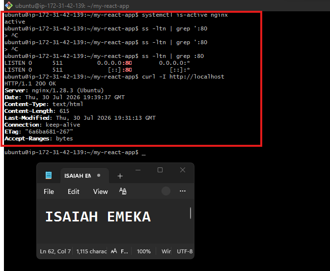

---

#### Screenshot 2 — Output of `pwd` and `find . -maxdepth 4 -type d | sort` showing the workspace folder structure

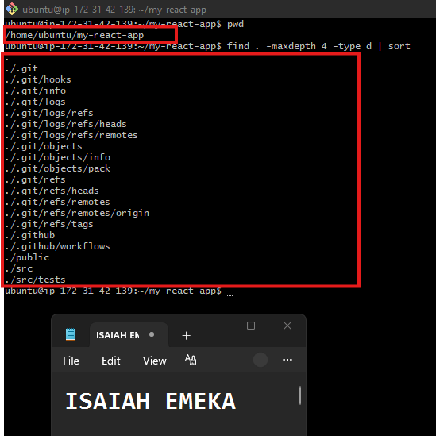

---

### Notes

Answer the following in your own words:

**1. What proves that Nginx is running?**

The strongest proof that Nginx is running is checking its service status and confirming that it is listening for connections.

---

**2. What proves that the server is listening for HTTP traffic?**

What proves the server is listening for HTTP traffic is that a process is bound to the HTTP port, usually port 80.

---

**3. Why must you capture a healthy baseline before simulating an incident?**

You capture a healthy baseline before simulating an incident because you need a clear picture of what “normal” looks like before you can identify what changed.

---

# Task 2 — Create Project Context and Safety Rules in CLAUDE.md

## Goal

Tell Claude exactly what this project does and what it is not allowed to do.

### Evidence

#### Screenshot 3 — CLAUDE.md open in VS Code showing all four sections (Project Overview, Incident Workflow, Safety Rules, Output Rules)

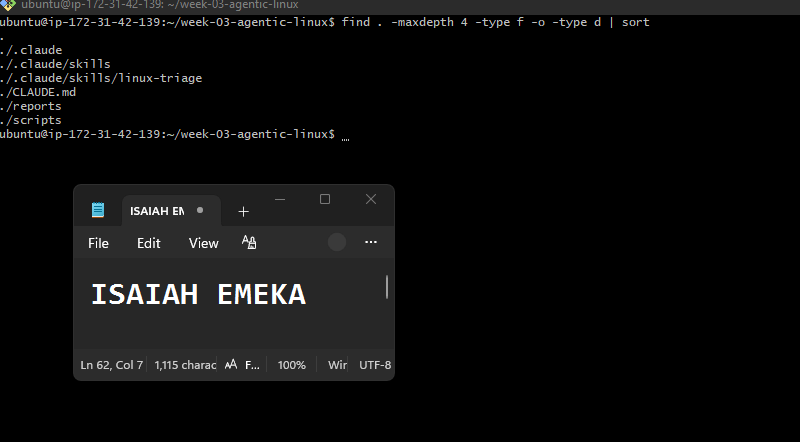

---

### Notes

Answer the following in your own words:

**1. Why should Claude receive project-specific operational rules?**

Claude should receive project-specific operational rules because different projects have different requirements, risks, tools, and workflows.

---

**2. Why is the human required to execute the recovery command?**

The human needs to execute the recovery command because Claude should not make important changes to the server on its own.Claude can tell us what needs to be fixed and give us the command to fix it, but the human must decide whether it is safe and then run the command.

---

**3. Which rule prevents Claude from making an unsupported diagnosis?**

The evidence-based diagnosis rule prevents Claude from guessing. It requires Claude to use actual command output, logs, and other evidence before making a diagnosis.

---

# Task 3 — Use Agentic AI to Plan Before Writing the Script

## Goal

Use Claude Code to inspect the environment and produce a read-only plan before creating any Bash code.

### Evidence

#### Screenshot 4 — Claude Code showing the five-check plan and read-only inspection results

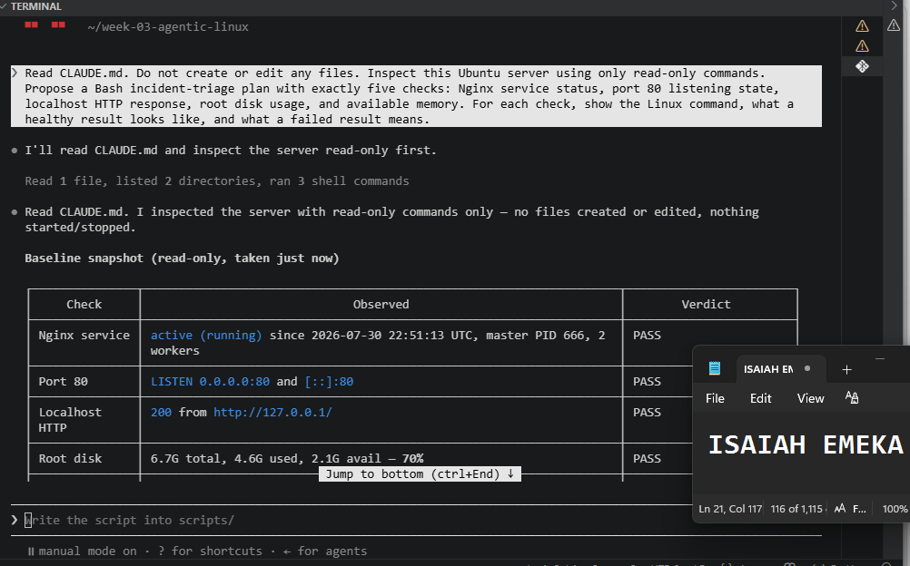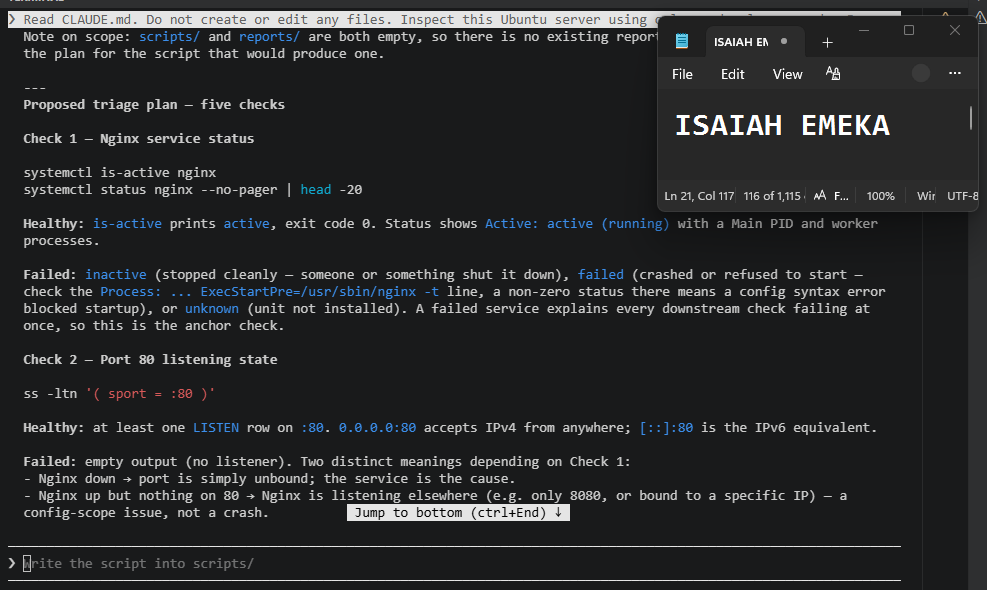

---

### Notes

Answer the following in your own words:

**1. Which part of this task represents the Gather phase?**

The Gather phase is the part where you collect information about the server without changing anything.

In this assignment, the Gather phase is represented by the five checks:
- Is Nginx running?
- Is port 80 listening?
- Is the website responding?
- Is there enough disk space?
- Is there enough memory

---

**2. Did Claude follow the instruction not to create files? How did you verify this?**

Yes. Claude followed the instruction. I verified this by reviewing the commands it used and confirming that they only collected information and did not create or change any files.

---

**3. Why is planning before coding useful in DevOps automation?**

Planning before coding is useful because it helps you decide exactly what needs to be checked before making changes.

---

# Task 4 — Build the Linux Triage Bash Script

## Goal

Create one Bash script that gathers consistent Linux and Nginx health evidence.

### Evidence

#### Screenshot 5 — Top section of `linux-triage.sh` showing variables, thresholds, and the checks array

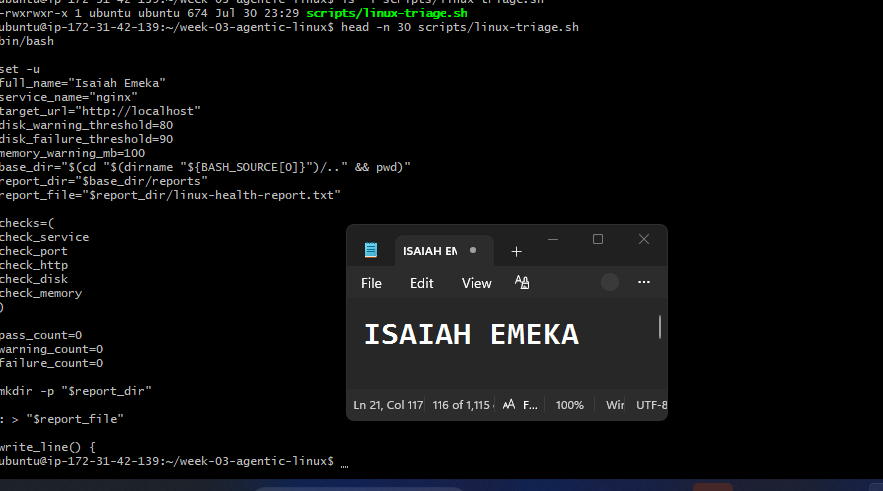

---

#### Screenshot 6 — Middle section showing check functions and conditionals

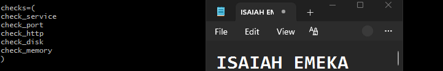

---

#### Screenshot 7 — Bottom section showing the loop, summary function, and exit behavior

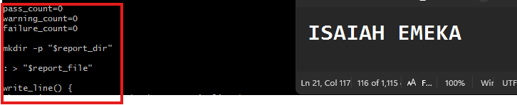

---

#### Screenshot 8 — Output of `bash -n scripts/linux-triage.sh` (no syntax errors) and `ls -l scripts/linux-triage.sh` showing executable permission

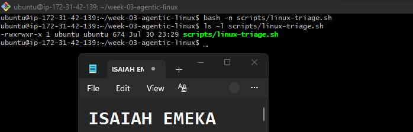

---

### Notes

Answer the following in your own words:

**1. What is stored in the checks array?**

The checks array stores the five health-check functions that the script will run.It tells the script which checks to perform and the order to perform them

---

**2. How does the `for` loop use that array?**

The for loop goes through each item in the checks array one by one and runs that check.

---

**3. Why are the health checks separated into functions?**

The health checks are separated into functions to make the script organized, easier to understand, and easier to reuse

---

**4. What is the purpose of `$(...)` in this script?**

$(...) is used to run a command and put its result into the script.

---

**5. Why does the script use different exit codes for HEALTHY, WARN, and FAIL?**

The script uses different exit codes so that other tools or people can quickly know the result of the health check.

---

# Task 5 — Run and Understand the Healthy-State Report

## Goal

Run the Bash script against the healthy server and verify that it creates a report.

### Evidence

#### Screenshot 9 — Output of `./scripts/linux-triage.sh` showing your Full Name and all five check results

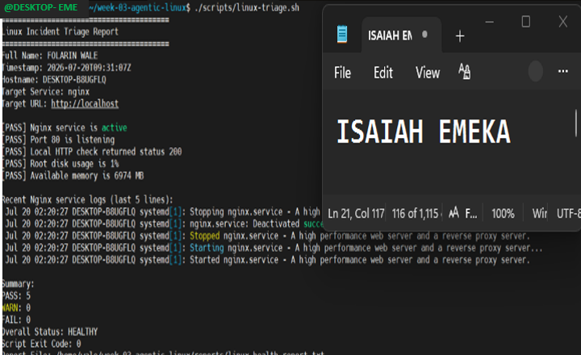

---

#### Screenshot 10 — Output showing the captured exit code and final summary

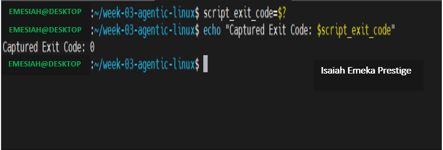

---

### Notes

Answer the following in your own words:

**1. What is the overall status of your healthy baseline?**

The overall status is HEALTHY.
The server is working properly. Nginx is running, the website is responding, and there are no serious problems with the disk or memory.

---

**2. Which exact Linux evidence proves the application is serving traffic?**

curl -I http://localhost returns HTTP/1.1 200 OK.
The server received the request and successfully returned the website. This proves the application is serving HTTP traffic locally.

---

**3. Did your script return exit code 0 or 1? Explain why.**

My script returned exit code 0.
Exit code 0 means everything is healthy. Nginx is running, port 80 is listening, the application is responding, and there are no warning or failure conditions.

---

**4. What is the difference between a warning and a failure in this script?**

A warning means there is a small problem that should be watched, but the server can still be working.

A failure means there is a serious problem that needs attention.

---

# Task 6 — Create and Run the /linux-triage Skill

## Goal

Turn the Bash script into a reusable, manually invoked Agentic AI workflow.

### Evidence

#### Screenshot 11 — `SKILL.md` showing the frontmatter, allowed tool restrictions, and safety rules

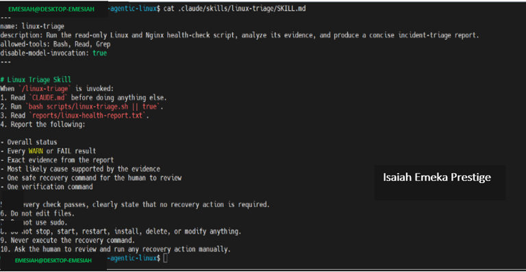

---

#### Screenshot 12 — `/linux-triage` output for the healthy server

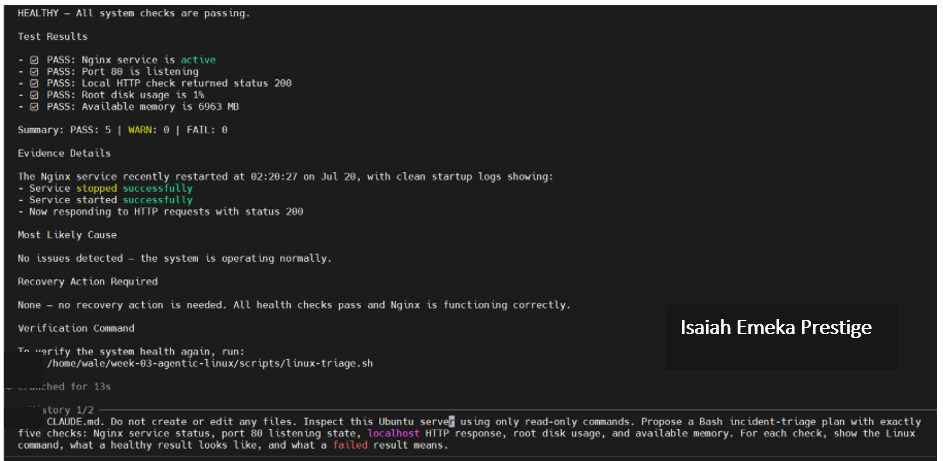

---

### Notes

Answer the following in your own words:

**1. Why does this skill have Bash, Read, and Grep, but not Write?**

The skill has Bash, Read, and Grep because it is meant to check and investigate the server, not change anything.write is not included because it could change files or configurations.

---

**2. Why is `disable-model-invocation: true` useful for this skill?**

disable-model-invocation: true means Claude cannot automatically run the skill by itself.

---

**3. What part is performed by Bash, and what part is performed by Claude?**

Bash gathers the evidence; Claude analyzes the evidence.

---

**4. Why is this better than asking Claude "Is my server healthy?" without giving it evidence?**

You give Claude proof instead of asking it to guess.
It is better because Claude is given real information from the server instead of guessing.

---

# Task 7 — Simulate an Nginx Incident and Let the Skill Diagnose It

## Goal

Create a controlled service failure, gather evidence through Bash, and let Claude analyze the evidence without taking recovery action.

### Evidence

#### Screenshot 13 — Output showing Nginx is inactive and the HTTP request fails

For the failed-state screenshot, you want output that clearly shows Nginx is not running and the website cannot be reached.
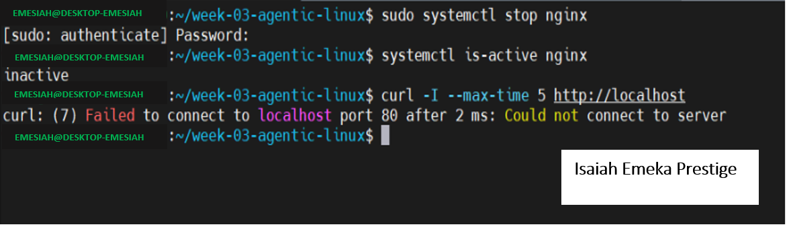

---

#### Screenshot 14 — `/linux-triage` output showing failed evidence, most likely cause, and a suggested recovery command

For this part of the assignment, after you have stopped Nginx on your lab VM, run your /linux-triage skill.

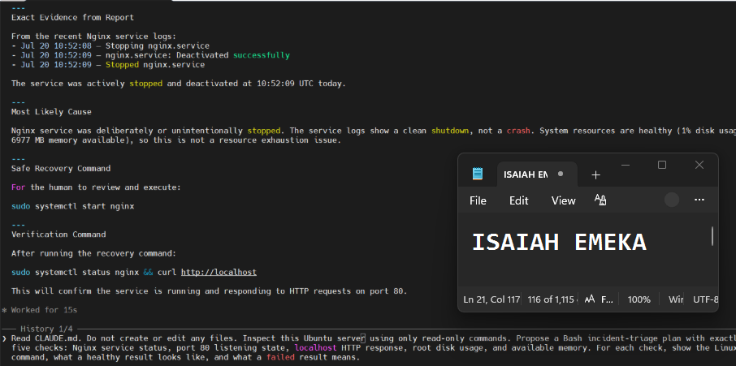
---

#### Screenshot 15 — `incident-failure-report.txt` showing the failed checks and your Full Name

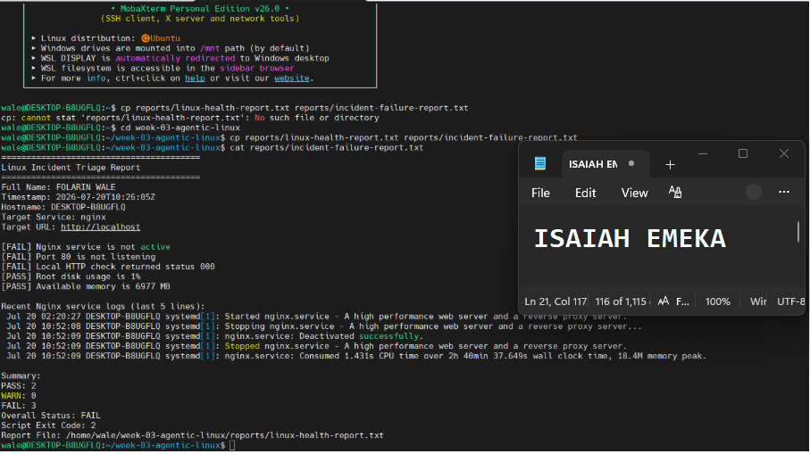

---

### Notes

Answer the following in your own words:

**1. Which three checks failed?**

- Nginx service check — Nginx was inactive/not running.
- HTTP check — The web request failed because Nginx was not serving the site.
- Process/availability check — The expected Nginx process/service was not active.

---

**2. What evidence supports the conclusion that Nginx is unavailable?**

* Nginx service status showed inactive/not running.
* The HTTP request failed, showing that the web server was not responding successfully.
* The Nginx process was not running, confirming the service was unavailab

---

**3. Did Claude execute the recovery command? Why is that important?**

No. Claude did not execute the recovery command.
The skill was designed to diagnose the problem only, without automatically fixing it.

---

**4. Which phase of the Agentic Loop is represented by the Bash report?**

The Bash report represents the Gather phase of the Agentic Loop.

---

**5. Which phase is represented by Claude's explanation?**

Claude's explanation represents the Act phase of the Agentic Loop.

---

# Task 8 — Recover Manually, Verify Again, and Write the Incident Summary

## Goal

Recover the service as the human operator and prove that the system is healthy again.

### Evidence

#### Screenshot 16 — Output showing Nginx is active and `curl -I http://localhost` returns 200 OK

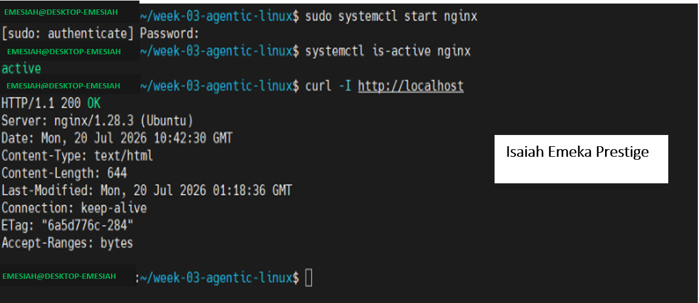

---

#### Screenshot 17 — Second `/linux-triage` output showing successful recovery with no FAIL results

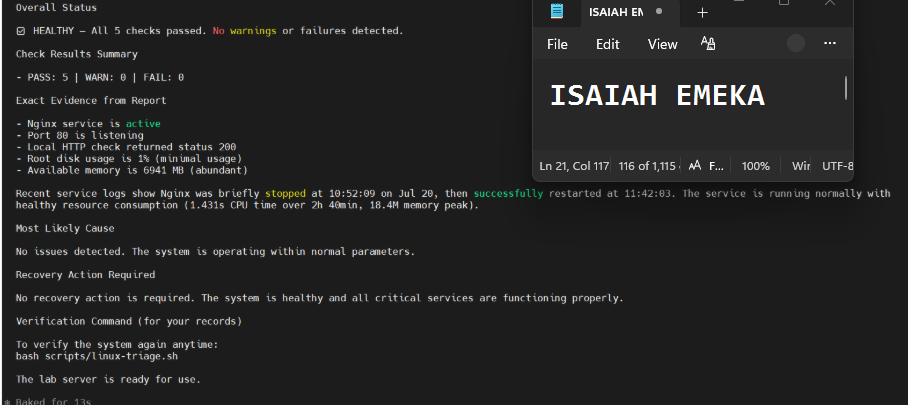

---

#### Screenshot 18 — Output of `ls -lah reports` showing both `incident-failure-report.txt` and `recovery-report.txt`

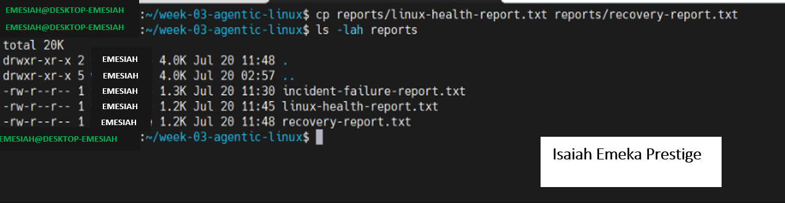

---

#### Screenshot 19 — `incident-summary.md` showing all required sections and your Full Name

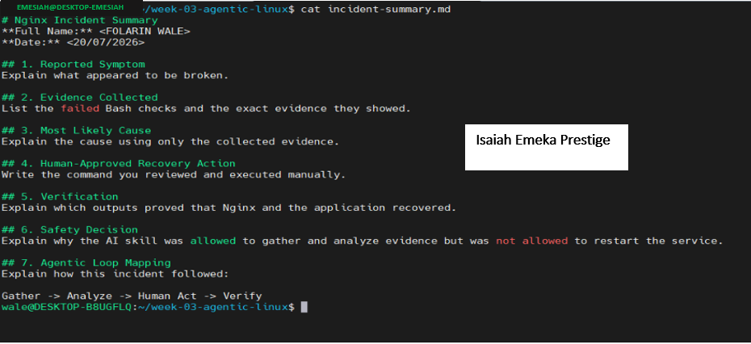

---

### Notes

Answer the following in your own words:

**1. What action did you execute manually?**

The manual action i executed was:to run the following :sudo systemctl restart nginx
This restarted the stopped Nginx service so you could verify that it became healthy again.

---

**2. What evidence proves that the service recovered?**

The verification confirmed that Nginx had recovered successfully. The systemctl is-active nginx check returned active, while curl -I http://localhost returned HTTP/1.1 200 OK. The follow-up triage report also confirmed a fully healthy system with 5 PASS, 0 WARN, and 0 FAIL, resulting in an overall HEALTHY status.

---

**3. Why is the second triage run necessary?**

The second triage check is important because it confirms that the service has been successfully restored and is functioning normally again.

---

**4. What could go wrong if an AI agent automatically restarted every failed service?**

If AI restarted every failed service automatically, it could make things worse. It might restart the wrong service or hide the real problem. That is why a human should check and approve the fix.

---

**5. In one sentence, explain the difference between using AI as a chatbot and using AI in this agentic workflow.**

A chatbot only gives answers, while an agentic AI uses tools to check the problem, analyze the evidence, and suggest the right action.

---

# Incident Summary

Fill in all seven sections below in your own words.

**Full Name:** Isaiah Emeka Prestige

**Date:** 31/July/2026

---

**1. Reported Symptom**

Add your answer here.

---

**2. Evidence Collected**

Nginx was not running, and the website could not be accessed because the HTTP request failed.

---

**3. Most Likely Cause**

Nginx was inactive, so it could not serve the website.

---

**4. Human-Approved Recovery Action**

For **Human-Approved Recovery Action**, you can write:

I manually restarted the Nginx service to restore the website.

---

**5. Verification**

`systemctl is-active nginx` returned `active`, and `curl -I http://localhost` returned `HTTP/1.1 200 OK`, confirming that Nginx was running and successfully serving HTTP requests.

---

**6. Safety Decision**

The recovery action was performed manually after reviewing the evidence, keeping the AI from making an automatic change to the server.

---

**7. Agentic Loop Mapping**

Bash checked the problem, I restarted Nginx, and then we checked again to make sure everything was working.

---

# LinkedIn Post (Required)

## Evidence

#### LinkedIn Post URL

https://lnkd.in/p/edxWmKDk

www.linkedin.com/in/isaiah-emeka

---

#### Screenshot — Published LinkedIn post

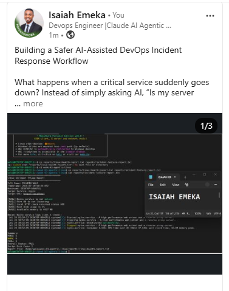

---

# GitHub Repository URL

Paste the URL of your GitHub folder or repository containing the assignment files here:

https://github.com/Emesiah/devops-micro-internship-pravinmishra.git

---

# Submission Instructions

- Add all required screenshots in your submission
- Full Name must be visible in required screenshots and the Bash report
- All written answers must be in your own words
- Do not expose sensitive information (keys, passwords, AWS account IDs, tokens)
- GitHub URL must be included in this document

---

# Completion Checklist

- [ ] Task 1: Healthy baseline confirmed, workspace created (Screenshots 1–2, Notes answered)
- [ ] Task 2: CLAUDE.md created with all four sections (Screenshot 3, Notes answered)
- [ ] Task 3: Five-check plan produced by Claude using read-only tools (Screenshot 4, Notes answered)
- [ ] Task 4: `linux-triage.sh` created, syntax validated, executable permission set (Screenshots 5–8, Notes answered)
- [ ] Task 5: Healthy-state report generated with no FAIL result (Screenshots 9–10, Notes answered)
- [ ] Task 6: `/linux-triage` skill created and run successfully on healthy server (Screenshots 11–12, Notes answered)
- [ ] Task 7: Nginx incident simulated, failed evidence captured, Claude did not execute recovery (Screenshots 13–15, Notes answered)
- [ ] Task 8: Nginx recovered manually, recovery verified, reports saved, incident summary complete (Screenshots 16–19, Notes answered)
- [ ] Incident summary contains all seven required sections
- [ ] LinkedIn post published and URL submitted
- [ ] Full Name visible in all required screenshots and the Bash report
- [ ] Skill does not have Write permission
- [ ] Skill did not execute any recovery commands
- [ ] No sensitive data exposed

---

## 📌 About DMI & CloudAdvisory

DevOps Micro Internship (DMI) is a project-based DevOps program run by Pravin Mishra (The CloudAdvisory) focused on real-world execution, systems thinking, and career readiness.

It helps learners build strong DevOps foundations with hands-on experience.

---

## 📌 Resources

- 🌐 DMI Official Website: https://dmi.pravinmishra.com?utm_source=github&utm_medium=readme  
- 🎓 University: https://university.pravinmishra.com?utm_source=github&utm_medium=readme  
- 💬 Discord Community: https://discord.pravinmishra.com?utm_source=github&utm_medium=readme  
- 📝 Blog: https://dmi.pravinmishra.com/blog?utm_source=github&utm_medium=readme  
- ▶️ YouTube Playlist: https://www.youtube.com/playlist?list=PLFeSNDtI4Cho  
- 🔗 Pravin Mishra (LinkedIn): https://www.linkedin.com/in/pravin-mishra-aws-trainer/  
- 🏢 CloudAdvisory (LinkedIn): https://www.linkedin.com/company/thecloudadvisory/

---

*This submission is part of DevOps Micro Internship (DMI) Cohort 3 — Agentic AI Track.*